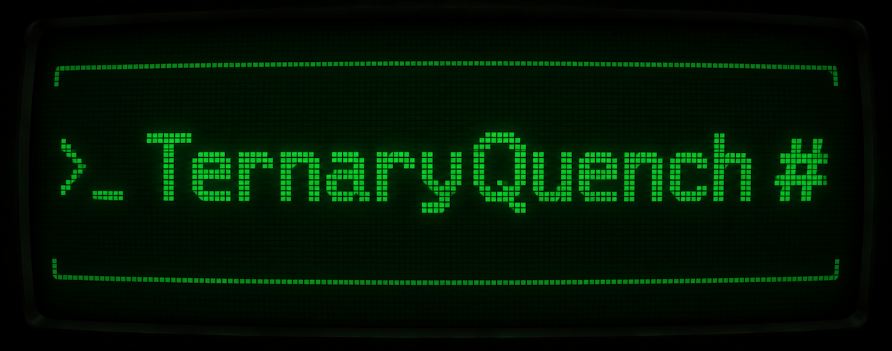

<div align="center">
  

  <h3>The open ternary trainer.</h3>

  <p>
    <a href="LICENSE"></a>
    <a href="https://www.python.org/"></a>
    <a href="https://pytorch.org/"></a>
    <a href="https://huggingface.co/penkia"></a>
  </p>
</div>

TernaryQuench gives you the complete recipe for building your own ternary
language models, from generating calibration data to exporting the file you run.

Start with an upstream Qwen checkpoint. Generate agentic calibration traces,
train with [CAT-Q-style reconstruction](https://arxiv.org/abs/2606.26650), and
export for local inference. Every stage is open source, including checkpoint
recovery and evaluation, so you can reproduce our models, inspect how they
were made, and change the recipe yourself.

The trainer supports Qwen3 and the text decoders of Qwen3.5/Qwen3.8. It learns
weights with three values per group: **−scale, 0, +scale**. The exporters let
you combine trained ternary layers with higher-precision layers in the same
model.

## Get started

Download [TernaryQuench Qwen3.8-27B — GGUF](https://huggingface.co/penkia/TernaryQuench-Qwen3.8-27B-GGUF),
or run it directly with [Ollama](https://ollama.com/download):

```sh
ollama run hf.co/penkia/TernaryQuench-Qwen3.8-27B-GGUF:Q2_K
```

Or use [llama.cpp](https://github.com/ggml-org/llama.cpp):

```sh
llama-cli -hf penkia/TernaryQuench-Qwen3.8-27B-GGUF:Q2_K -cnv -c 32768
```

The GGUF download is **10.86 GB**; allow additional memory for the context
cache and runtime. See the [model card](https://huggingface.co/penkia/TernaryQuench-Qwen3.8-27B-GGUF)
for scores, precision details, and limitations.

For native MLX applications, the [MLX model](https://huggingface.co/penkia/TernaryQuench-Qwen3.8-27B-MLX)
is a separate **10.53 GB** download. Its model card includes MLX setup and
evaluation results. Use the GGUF version above for Ollama or llama.cpp.

## Build from source

Build your own model from upstream weights using the Qwen3.8-27B recipe
below: generate traces, prepare calibration data, train, export, and evaluate.

Training at this size needs a high-memory GPU. Our reference training run
took **55 hours 38 minutes on 1× NVIDIA H200 (141 GB)**, excluding data
generation, export, and evaluation. The trainer checkpoints after each
window and can resume in a fresh job, including on a rented GPU. Export and
inference can run locally with enough memory for the chosen model.

Install [uv](https://docs.astral.sh/uv/), then clone and install the project:

```sh
git clone https://github.com/penk/ternary-quench.git
cd ternary-quench
uv sync --extra eval --extra gguf
```

The project uses Python 3.11, with dependencies pinned in `uv.lock`. For
MLX export and evaluation on macOS, install the additional dependencies with
`uv sync --extra mlx --extra eval`.

### 1. Generate calibration traces

Use the upstream model to generate tool-call traces for calibration. The
generator saves its output locally and uploads it to a Hugging Face dataset
repository. Authenticate first with `uv run hf auth login`, using a token
with write access to your dataset repository.

```sh
uv run ternary-quench-generate \
  --model Qwen/Qwen3.8-27B \
  --repo USER/agentic-calibration \
  --count 2500 --batch-size 8 \
  --nsamples 512 --seqlen 2048
```

Replace `USER/agentic-calibration` with your dataset repository; new
repositories are private by default. The packed rows are saved to
`out/traces/agentic-512x2048.npy` for the next step.

### 2. Prepare calibration data

The [AYOT-inspired mixture](https://arxiv.org/abs/2608.01078) combines agentic
traces with general text. This recipe assigns **10% of calibration rows** to
agentic data. That percentage describes row selection, not the share of
tokens or training gradients.

```sh
uv run ternary-quench-build-calibration \
  --model Qwen/Qwen3.8-27B \
  --agentic out/traces/agentic-512x2048.npy \
  --output-dir out/calibration --ratios 0.10
```

### 3. Train the ternary weights

Run the [Qwen3.8-27B recipe](recipes/qwen3.8-27b-agentic10.sh):

```sh
CALIB=out/calibration/mixed-agentic10-512x2048.npy \
  recipes/qwen3.8-27b-agentic10.sh
```

The trainer works through overlapping layer windows, matching the original
model's activations while accounting for the errors introduced by earlier
ternary layers. It writes the trained checkpoint to
`out/qwen3.8-27b/ternary.pt` and recovery checkpoints to
`out/qwen3.8-27b/checkpoints/`. Rerun the same command with `RESUME=1` to
continue from the latest complete checkpoint.

This is an independent implementation of the released CAT-Q method. It uses
learnable modulation and softened ternarization, then hardens the weights at
export. CAT-Q's unreleased hard-training phase is not reproduced.

### 4. Export a runnable model

For GGUF, prepare the pinned llama.cpp build:

```sh
scripts/prepare-llama-cpp.sh
```

The GGUF example below uses the release's precision layout: trained ternary
weights in layers 0–61, original BF16 weights in layers 62–63, and 4-bit
embeddings and output head. The count assertions check that the exporter
actually applies that layout.

```sh
uv run ternary-quench-export-gguf \
  --llama-cpp vendor/llama.cpp \
  --llama-cli vendor/llama.cpp/build/bin/llama-cli \
  --ternary-prefix out/qwen3.8-27b/ternary.pt \
  --base Qwen/Qwen3.8-27B \
  --filter-full-checkpoint \
  --suffix-from-layer 62 --suffix-type bf16 --top-type q4_1 \
  --expected-prefix-modules 481 \
  --expected-prefix-parameters 23595089920 \
  --expected-suffix-modules 15 --expected-top-modules 2 \
  --out out/TernaryQuench-Qwen3.8-27B-Q2_0.gguf
```

The exporter checks tensor counts and types, writes a checksum manifest, and
requires the pinned native llama.cpp loader to open the result. Use that
build for Q2_0: older builds used a different block layout under the same name.

Repack the ternary tensors into Q2_K for Ollama and standard llama.cpp builds:

```sh
uv run ternary-quench-repack-gguf \
  --llama-cpp vendor/llama.cpp \
  --source out/TernaryQuench-Qwen3.8-27B-Q2_0.gguf \
  --out out/TernaryQuench-Qwen3.8-27B-Q2_K.gguf \
  --expected-ternary-tensors 481
```

Q2_K preserves every sign and zero but rounds the group scales. The repacker
measures that error across every converted tensor and verifies that all
other tensors are unchanged. For this release, repacking adds 1.11 GB and
introduces 1.55% relative RMS weight error in the converted matrices. The model card
reports quality measured on the converted file.

For MLX, use an affine-quantized MLX copy of the same upstream model as the
base. This example exports all the trained matrices in `ternary.pt`; unlike
the GGUF example above, it does not restore a higher-precision tail. Tensors
absent from the checkpoint retain their base precision.

```sh
uv run ternary-quench-export-mlx \
  --ternary-prefix out/qwen3.8-27b/ternary.pt \
  --base /path/to/Qwen3.8-27B-4bit \
  --out out/TernaryQuench-Qwen3.8-27B-MLX
```

### 5. Evaluate

Check the exported model in its intended runtime, then measure quality.
For an Ollama model already downloaded with the Get started command, the
runtime smoke checks arithmetic, JSON output, and a tool-call round trip:

```sh
uv run ternary-quench-smoke \
  --model hf.co/penkia/TernaryQuench-Qwen3.8-27B-GGUF:Q2_K \
  --out results/ollama-smoke.json
```

The five-task zero-shot evaluation runs PIQA, ARC-Easy, ARC-Challenge,
HellaSwag, and WinoGrande. It saves the individual scores, their unweighted
mean, seeds, package versions, and raw results in JSON.

To establish the upstream Hugging Face model's reference scores:

```sh
uv run --extra eval ternary-quench-evaluate \
  --model Qwen/Qwen3.8-27B \
  --run-label qwen38-bf16 \
  --output results/qwen38-bf16-five-task.json
```

For an MLX export:

```sh
uv run --extra mlx ternary-quench-evaluate-mlx \
  --model out/TernaryQuench-Qwen3.8-27B-MLX \
  --label ternary-quench-qwen38 \
  --output results/ternary-quench-qwen38-five-task.json
```

Report the checkpoint, export format, runtime, and evaluation settings with
each score. The five tasks measure general quality; the runtime smoke checks
basic integration. Evaluate multi-turn agentic work separately on the tasks
you intend to use the model for.

## References and attribution

The released TernaryQuench Qwen3.8-27B model is a derivative of
[Qwen3.8-27B](https://huggingface.co/Qwen/Qwen3.8-27B), developed by
[Alibaba's Qwen team](https://github.com/QwenLM). The upstream weights are
released under [Apache-2.0](https://huggingface.co/Qwen/Qwen3.8-27B/blob/main/LICENSE).

- [CAT-Q](https://arxiv.org/abs/2606.26650) — ternary reconstruction method.
- [ScaleQ-1.58 / AYOT](https://arxiv.org/abs/2608.01078) — agentic calibration design.
- [BitTern](https://github.com/IntelChina-AI/BitTern) — source of the CAT-Q quantizer.
- [SliderQuant](https://github.com/deep-optimization/SliderQuant) — source of the window scheduler.
- [llama.cpp](https://github.com/ggml-org/llama.cpp) — GGUF conversion and inference.

`quantizer.py` derives from BitTern's `projects/cat-q/quantize/quantizer.py`.
`build_window_scheduler` and `huber_delta_at` in `train.py` derive from
SliderQuant's `quantize/sliderquant.py`. Those files carry modification notices.

Copyright 2026 Penk Chen. Licensed under [Apache-2.0](LICENSE).
